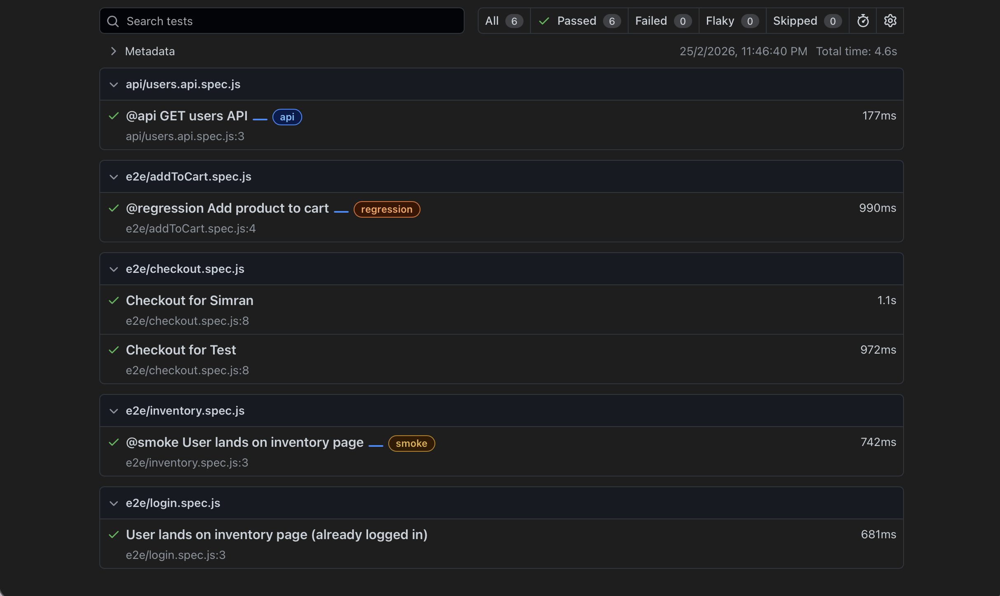
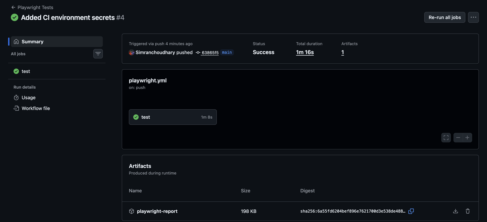

# Playwright E2E Automation Framework

## Overview

This project is a **hybrid automation framework** built using **Playwright with JavaScript**.
It demonstrates real-world test automation architecture including UI automation, API testing, reusable framework design, and CI integration.

The goal of this project is to showcase **end-to-end automation skills, framework design, and engineering best practices** suitable for production-level environments.

---

## Tech Stack

* Playwright (JavaScript)
* Node.js
* GitHub Actions (CI)
* HTML Reporter
* dotenv (Environment Config)

---

## Features

### UI Automation (SauceDemo)

* End-to-End test coverage
* Login reuse using storageState (Global Setup)
* Add to Cart
* Checkout Flow
* Assertions & Validations

### API Automation

* REST API testing using Playwright request
* Status validation
* Response data validation

### Framework Design

* Page Object Model (POM)
* Environment-based configuration (.env)
* Data-driven testing
* Reusable architecture
* Clean folder structure

### Execution & Reporting

* HTML reporting
* Parallel execution
* Retry on failure
* Tagging system (@smoke, @regression, @api)
* CI integration using GitHub Actions

---

## Test Report Screenshot



---

## CI Pipeline



---

## Project Structure

```
playwright-e2e/
│
├── tests/
│   ├── e2e/
│   ├── api/
│
├── pages/
│   ├── LoginPage.js
│   ├── InventoryPage.js
│   ├── CartPage.js
│   ├── CheckoutPage.js
│
├── utils/
│   ├── env.js
│   ├── testData.js
│
├── global-setup.js
├── playwright.config.js
├── .env
├── README.md
```

---

## Environment Setup

Create a `.env` file in the root:

```
BASE_URL=https://www.saucedemo.com
USERNAME=standard_user
PASSWORD=secret_sauce
```

---

## Installation

```bash
npm install
npx playwright install
```

---

## Running Tests

Run all tests:

```bash
npm test
```

Run smoke tests:

```bash
npm run smoke
```

Run regression tests:

```bash
npm run regression
```

Run API tests:

```bash
npm run api
```

Run in headed mode:

```bash
npx playwright test --headed
```

Open HTML report:

```bash
npm run report
```

---

## Global Authentication (storageState)

The framework uses Playwright **global setup** to:

* Perform login once
* Save session state
* Reuse authentication across tests
* Improve execution speed

---

## CI Integration

GitHub Actions automatically runs tests on every push to the main branch.
Test reports are generated and stored as artifacts.

---

## Engineering Practices Demonstrated

* Modular framework design
* Reusable page objects
* Environment-driven configuration
* Data-driven testing
* API + UI hybrid automation
* CI/CD pipeline integration
* Optimized execution using storageState
* Clean and maintainable code structure

---

## Future Improvements

* Allure Reporting
* Docker execution
* Cross-browser matrix in CI
* Test data management via JSON/CSV
* UI + API integration validation

---

## Author

**Simran Choudhary**
QA Automation Engineer
Playwright | Automation Framework Design | CI/CD
